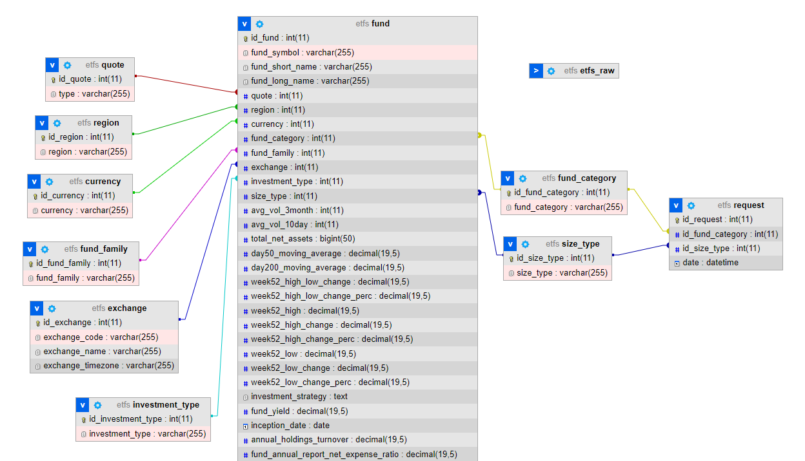

# radicant Challenge

## 1. Create MySQL db

## 2. Create table with all columns as text type (etfs_raw)

## 3. Import from data csv

```sql
LOAD DATA INFILE 'C:\\Users\\David Xavier\\Desktop\\radicant\\radicant_de_challenge\\radicant_de_challenge\\ETFs_original.csv'
INTO TABLE etfs_raw
FIELDS TERMINATED BY ','
ENCLOSED BY '"'
LINES TERMINATED BY '\n'
```

## 4. Create tables with data types
fund
quote
region
fund_family
exchange
currency

## 5. Load tables

Example for currency:

```sql
INSERT INTO currency (currency)
SELECT DISTINCT(currency)
FROM etfs_raw
```

## 6. Load fund table
Contains fk to the other tables and all other fields

## 7. Update references

Example for currency

```sql
UPDATE fund as f
	INNER JOIN etfs_raw as e ON e.fund_symbol=f.fund_symbol
	INNER JOIN currency as c ON e.currency=c.currency
SET f.currency = c.id_currency
```

## 8. Fix some formats

## 9. Convert dates

```sql
STR_TO_DATE(e.inception_date,'%d.%m.%Y')
```

## 10. Create view

```sql
CREATE VIEW esg_filter_funds AS
	SELECT fund_symbol, fc.fund_category, st.size_type
	FROM fund f
		JOIN size_type st on st.id_size_type = f.size_type
		JOIN fund_category fc on fc.id_fund_category = f.fund_category
```
## DB Diagram


## Create Flask API

## To test?
1. Run etfs.sql to MySQL engine
2. Run radicant_esg_api
3. Make request

## Sample request (GET or POST)
curl "localhost:5000/filter_funds?id_fund_category=2&id_size_type=1" -X POST -H "Accept: application/json"

